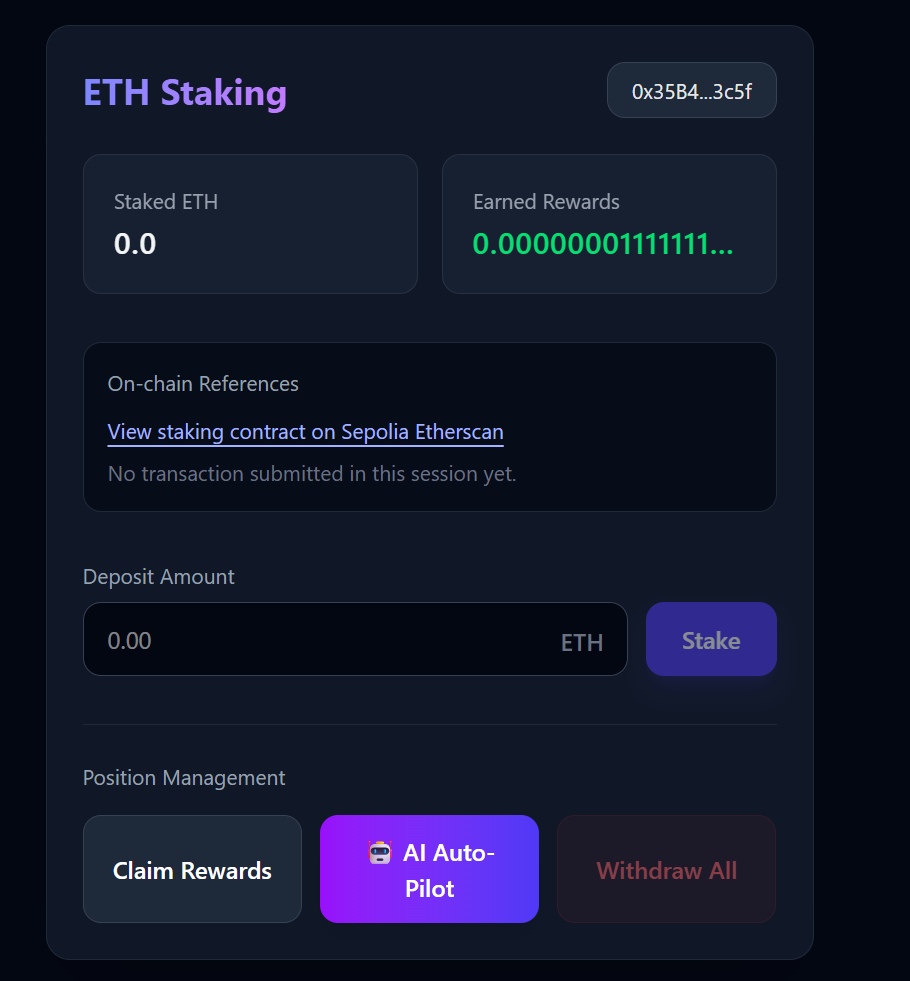
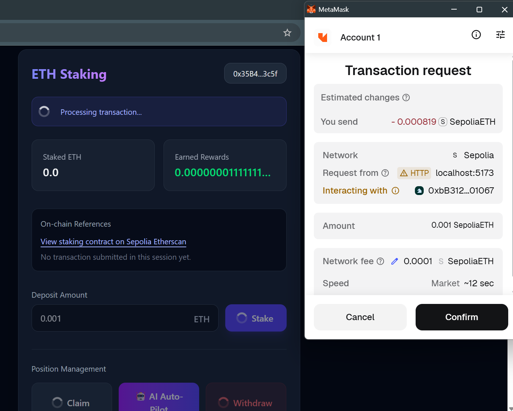
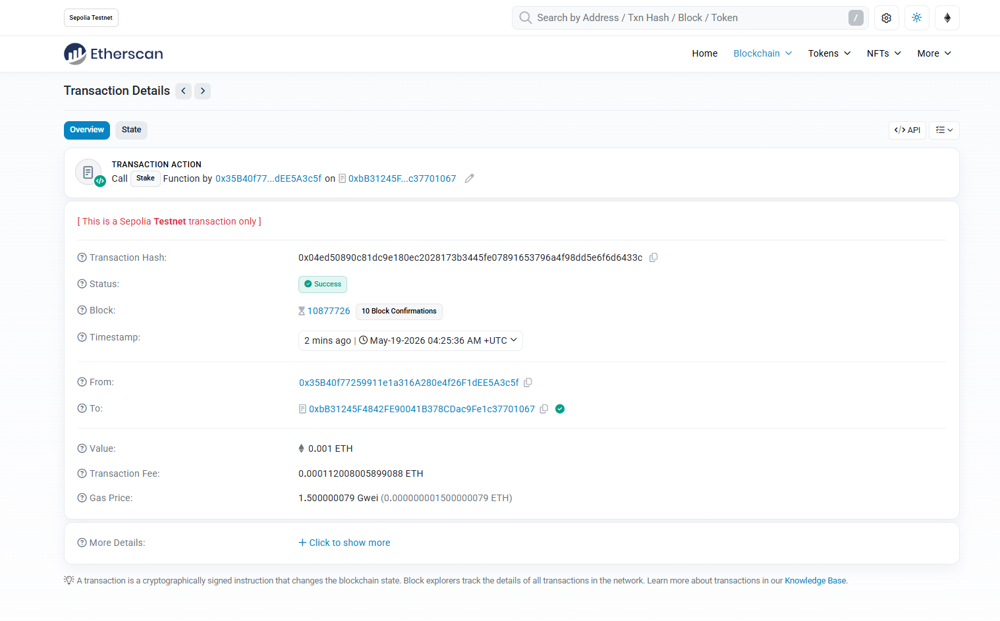
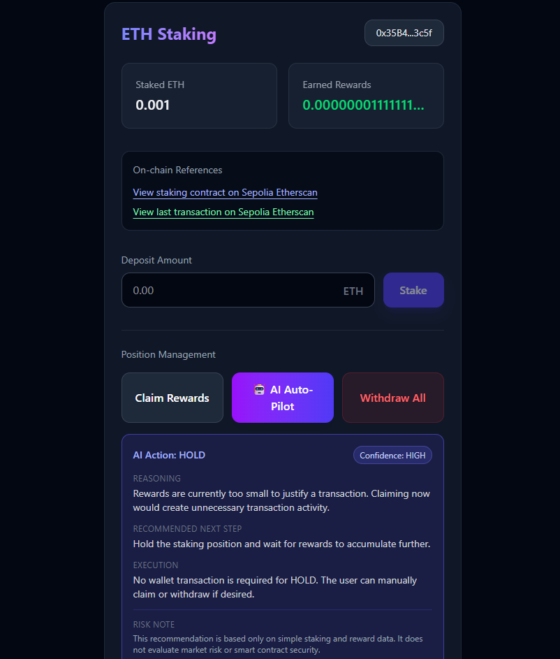

# Agentic Staking Dashboard PoC

A portfolio Proof of Concept demonstrating how an AI-assisted Web3 operator workflow can turn Solidity smart contract logic into a usable React staking dashboard with wallet interaction, transaction transparency, and an explainable mock DeFi agent layer.

This project is part of my transition toward AI Operator / AI Solutions Developer work with a Web3 focus.

## Overview

`agentic-staking-dashboard-poc` demonstrates a full Solidity-to-UI integration workflow:

- Deployed staking smart contract on Ethereum Sepolia
- React / TypeScript dashboard
- MetaMask wallet connection
- Staking, withdrawal, and reward interaction flow
- Sepolia Etherscan links for contract and transaction transparency
- Safe mock DeFi agent decision layer
- Human-confirmed blockchain execution

The goal is not only to build a staking dashboard, but to show how AI-assisted workflows can help Web3 teams move from smart contract logic to usable frontend interfaces faster and more safely.

## Demo Preview

### Connected Dashboard



### MetaMask Transaction Confirmation



### Sepolia Etherscan Transaction



### AI Auto-Pilot Recommendation



## Architecture Diagram

The project architecture is documented in:

- [`Architecture Documentation`](docs/ARCHITECTURE.md)
- [`Architecture Diagram`](docs/architecture-diagram.md)
- [`Portfolio Case Study`](docs/CASE_STUDY.md)

High-level flow:

```text
React Dashboard
  → wagmi / viem
  → MetaMask
  → Sepolia Staking Contract
  → Etherscan Transparency
  → Mock DeFi Agent Recommendation
  → Human-Approved Execution
```

## Problem

In Web3 projects, connecting Solidity smart contracts to frontend applications is often repetitive, slow, and error-prone.

Teams usually need to manually build:

- Contract ABI integration
- Wallet connection logic
- Read/write contract hooks
- Transaction pending states
- Transaction confirmation handling
- MetaMask rejection handling
- User-facing error states
- Explorer links for transparency
- UI components for contract interaction

This creates friction between smart contract development and real user-facing dApp interfaces.

## Solution

This PoC shows an AI-assisted operator workflow for generating, validating, and connecting a working Web3 frontend integration.

The workflow includes:

- Translating Solidity contract functions into frontend actions
- Building reusable React hooks
- Connecting wagmi / viem contract calls
- Handling MetaMask wallet states
- Showing transaction status to the user
- Linking transactions to Sepolia Etherscan
- Adding a safe mock agent layer that explains possible next actions

The AI layer does not execute transactions automatically. It only provides explainable recommendations. The user remains in control and confirms every blockchain action through MetaMask.

---

## Live Contract

**Network:** Ethereum Sepolia Testnet

**Contract Address:**

```text
0xbB31245F4842FE90041B378CDac9Fe1c37701067
```

**Sepolia Etherscan:**

```text
https://sepolia.etherscan.io/address/0xbB31245F4842FE90041B378CDac9Fe1c37701067
```

## Tech Stack

- React
- TypeScript
- Vite
- Solidity
- wagmi
- viem
- TanStack React Query
- Tailwind CSS
- MetaMask
- Ethereum Sepolia Testnet
- Remix IDE

## Project Structure

```text
src/
  components/
    StakingDashboard.tsx
  hooks/
    useStaking.ts
    useDeFiAgent.ts
  App.tsx
  main.tsx
  wagmi.ts
  index.css

contracts/
  StakingContract.sol

prompts/
  system-instruction.md
  iteration-log.md
  defi-context.md

docs/
  ARCHITECTURE.md
  CASE_STUDY.md
  architecture-diagram.md
  assets/
```

## Smart Contract Features

The Solidity staking contract supports:

- Staking ETH
- Withdrawing staked ETH
- Claiming accumulated rewards
- Reading user stake
- Reading user rewards
- Funding the reward pool
- Owner-controlled reward rate

The contract is deployed on Sepolia for demonstration purposes only.

## Frontend Features

The React dashboard supports:

- MetaMask wallet connection
- ETH staking input
- Staked balance display
- Earned rewards display
- Claim rewards action
- Withdraw action
- Loading states during transactions
- User-facing error messages
- Transaction confirmation flow
- Automatic UI refresh after confirmed transactions
- Sepolia Etherscan links for contract and transaction review

## Mock DeFi Agent Layer

The project includes a safe mock DeFi agent decision layer.

The agent evaluates the current staking position and returns:

- Suggested action
- Confidence level
- Reasoning
- Recommended next step
- Execution guidance
- Risk note

Current supported actions:

```text
STAKE_MORE
CLAIM_REWARDS
WITHDRAW_ALL
HOLD
```

The agent does not control the wallet and does not submit transactions automatically.

The intended pattern is:

```text
AI suggests → User reviews → MetaMask confirms → Blockchain executes
```

This keeps the system explainable, auditable, and human-approved.

## Verified Flow

The end-to-end flow was tested on Ethereum Sepolia:

```text
React UI
  → wagmi / viem hook
  → MetaMask transaction request
  → Sepolia smart contract
  → transaction confirmation
  → updated on-chain staking balance in UI
  → Etherscan transaction review
  → mock agent recommendation
```

Tested actions:

- Wallet connection
- Stake transaction
- Transaction pending state
- On-chain balance update
- Withdraw transaction
- Rewards state update
- Etherscan transaction link
- Mock agent recommendation rendering

## AI Operator Role

This project was built as an AI Operator workflow.

The operator role included:

- Defining the system instructions
- Guiding AI-assisted code generation
- Validating generated React and TypeScript code
- Fixing deprecated wagmi / viem usage
- Improving React hook dependencies
- Resolving wallet connector issues
- Deploying the contract through Remix
- Connecting the frontend to a live Sepolia smart contract
- Adding transaction transparency through Etherscan links
- Designing a safe human-in-the-loop agentic decision layer

The purpose is to demonstrate not only frontend implementation, but also operator judgment, architecture decisions, and safe AI-assisted Web3 delivery.

## Security & Safety Notes

This is a portfolio PoC running on Sepolia testnet.

Current safety boundaries:

- No private keys are stored in the frontend
- All transactions require MetaMask confirmation
- The mock agent does not execute blockchain actions automatically
- No autonomous fund management is implemented
- No production yield strategy is used
- No real financial advice is provided
- Etherscan links are included for transparency

Future production AI integration should use a secure backend or serverless proxy.

AI API keys should not be exposed directly in frontend code.

Recommended production pattern:

```text
Frontend → Backend / Serverless Proxy → AI API
```

## How to Run

Install dependencies:

```bash
npm install
```

Start the development server:

```bash
npm run dev
```

Build the project:

```bash
npm run build
```

## Documentation

Current documentation:

- [`Architecture Documentation`](docs/ARCHITECTURE.md)
- [`Architecture Diagram`](docs/architecture-diagram.md)
- [`Portfolio Case Study`](docs/CASE_STUDY.md)
- `prompts/system-instruction.md`
- `prompts/iteration-log.md`
- `prompts/defi-context.md`

Demo assets:

- `docs/assets/dashboard-connected.png`
- `docs/assets/metamask-transaction.png`
- `docs/assets/etherscan-transaction.png`
- `docs/assets/ai-recommendation.png`

Planned documentation:

- Security and production-readiness notes
- Secure AI proxy architecture
- LinkedIn / portfolio case study post

## Current Status

Portfolio PoC / work in progress.

Completed:

- Deployed Sepolia staking contract
- Hardened staking contract with a custom `nonReentrant` guard
- React staking dashboard
- MetaMask wallet flow
- Staking and withdrawal interaction
- Etherscan contract and transaction links
- Safe mock DeFi agent decision layer
- Explainable recommendation UX
- Dashboard demo screenshots
- Architecture documentation
- Architecture diagram
- Portfolio case study
- Add Sepolia network guard
- Improved transaction status UX

Next planned improvements:

- Add secure AI proxy architecture example
- Improve reward pool UX
- Add production security notes for the Solidity contract

## Portfolio Positioning

This project demonstrates the ability to combine:

- Frontend engineering
- Solidity-to-UI integration
- Web3 wallet UX
- Transaction transparency
- AI-assisted development
- Agentic workflow design
- Human-in-the-loop automation

The main value of the project is the workflow behind it: using AI-assisted operator methods to transform smart contract logic into a usable, explainable, and safer Web3 interface.

This project is part of a broader path toward AI Operator / AI Solutions Developer work focused on Web3 automation, agentic dashboards, and remote crypto-paid opportunities.
