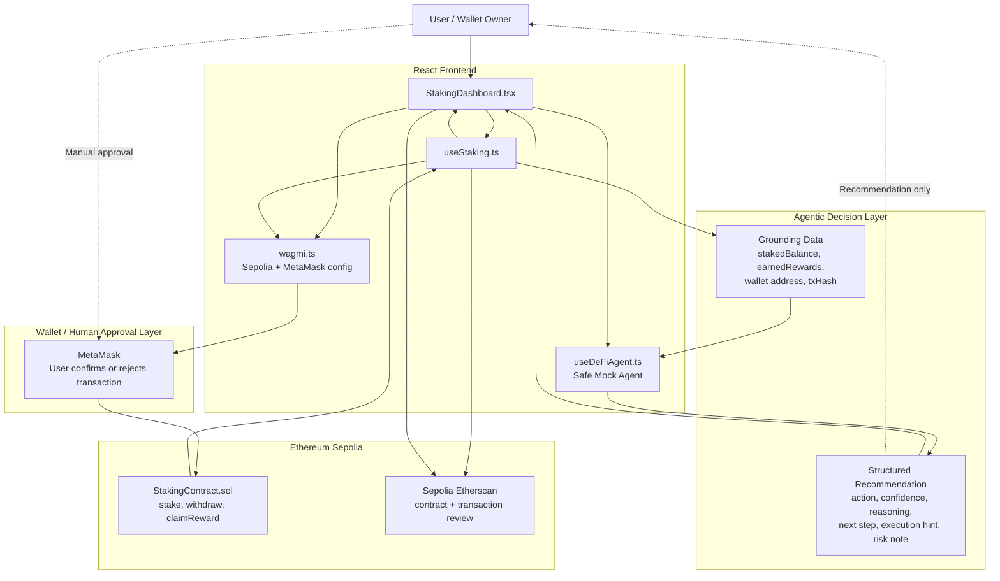

# Architecture Diagram — Agentic Staking Dashboard PoC

This diagram shows the current architecture of the project: a React dashboard connected to a deployed Sepolia staking contract, with MetaMask-confirmed transactions, Etherscan transparency, and a safe mock DeFi agent recommendation layer.



---

## Four-Layer View

```text
Layer 1 — Grounding / On-chain Data
  Wallet address, staking balance, earned rewards, contract address, transaction hash

Layer 2 — Web3 Integration
  wagmi, viem, MetaMask, Sepolia, contract reads and writes

Layer 3 — Agentic Decision Layer
  Safe mock DeFi agent returns structured recommendations

Layer 4 — Human-Approved Execution
  User reviews recommendation and confirms transactions through MetaMask
```

---

## Safety Principle

```text
AI suggests → User reviews → MetaMask confirms → Blockchain executes
```

The mock agent does not execute transactions automatically. It only explains a possible next action.
