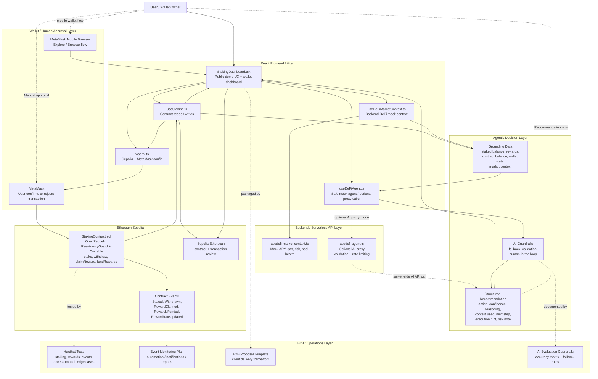

# Architecture Diagram — Agentic Staking Dashboard PoC

This diagram shows the current architecture of the project: a React / TypeScript dashboard connected to a deployed Ethereum Sepolia staking contract, with MetaMask-confirmed transactions, Etherscan transparency, reward pool visibility, backend DeFi mock context, a safe mock AI recommendation layer, optional serverless AI proxy architecture, and human-approved blockchain execution.

The project is designed as a portfolio PoC for AI Operator / Web3 Solutions Developer work.

---

## High-Level Architecture



---

## Four-Layer View

```text
Layer 1 — Grounding / On-chain + Backend Context

  Wallet address
  Connected network
  Staked balance
  Earned rewards
  Contract reward pool balance
  Last transaction hash
  Sepolia contract address
  Etherscan links
  Mock APY
  Gas condition
  Pool health
  Risk level
  Liquidity status
  Backend market note

Layer 2 — Web3 Integration

  wagmi
  viem
  MetaMask
  MetaMask Mobile Browser
  Ethereum Sepolia
  Contract reads
  Contract writes
  Transaction receipt waiting
  Network guard
  Etherscan transparency

Layer 3 — Agentic Decision Layer

  Safe mock DeFi agent by default
  Optional backend/serverless AI proxy
  Structured JSON recommendation
  AI request validation
  AI response normalization
  Fallback to HOLD
  AI evaluation guardrails
  Backend DeFi mock context

Layer 4 — Human-Approved Execution

  User reviews recommendation
  User manually clicks action
  MetaMask opens
  User confirms or rejects
  Blockchain executes
  Etherscan provides external verification
```

---

## Execution Flow

```text
User opens dashboard
  → dashboard loads public demo UI
  → user may review read-only context without wallet
  → user connects MetaMask
  → dashboard checks Sepolia network
  → dashboard reads staking state and reward pool balance
  → user may stake / fund pool / claim / withdraw
  → MetaMask confirms transaction
  → Sepolia smart contract executes transaction
  → contract emits event
  → dashboard refreshes state
  → Etherscan link provides transaction proof
```

---

## AI Recommendation Flow

```text
User clicks AI Auto-Pilot
  → dashboard gathers current staking state
  → dashboard fetches backend DeFi mock context
  → safe mock agent or optional AI proxy evaluates state
  → response is normalized into structured decision
  → UI displays:

      AI Action
      Confidence
      Reasoning
      Context Used
      Recommended Next Step
      Execution
      Risk Note

  → user decides manually
  → no transaction happens unless user confirms through MetaMask
```

---

## Optional AI Proxy Flow

```text
React Frontend
  │
  │ sends compact staking + context payload
  ▼
api/defi-agent.ts
  │
  │ validates request body
  │ applies basic rate limiting
  │ builds compact AI prompt
  ▼
AI Model
  │
  │ returns structured JSON
  ▼
api/defi-agent.ts
  │
  │ validates / normalizes response
  │ falls back to HOLD if invalid
  ▼
React Frontend
  │
  │ displays recommendation
  ▼
User
  │
  │ manually confirms through MetaMask if desired
  ▼
Blockchain
```

---

## Event Monitoring Automation Flow

```text
Smart contract emits event
  │
  │ Staked / Withdrawn / RewardClaimed / RewardsFunded / RewardRateUpdated
  ▼
Event listener / automation worker
  │
  │ parses event logs
  │ validates event data
  │ optionally waits for confirmations
  ▼
Automation layer
  │
  ├─ stores event
  ├─ updates analytics
  ├─ triggers notification
  └─ sends event context to AI reporting layer
        │
        ▼
Telegram / Discord / Email / Dashboard report
```

---

## Mobile Wallet Flow

```text
Regular mobile browser
  │
  │ may not expose MetaMask provider
  ▼
Public Demo Mode
  │
  │ shows read-only demo features
  │ shows mobile wallet guidance
  ▼
MetaMask app
  │
  │ Explore / Browser
  ▼
Open deployed Vercel demo URL
  │
  ▼
Connect Wallet
  │
  ▼
Use Sepolia wallet actions
```

Recommended mobile path:

```text
MetaMask app
  → Explore / Browser
  → open https://agentic-staking-dashboard-poc.vercel.app
  → connect wallet
  → switch to Sepolia if needed
```

---

## Smart Contract Layer

The deployed staking contract supports:

```text
stake()
withdraw()
claimReward()
fundRewards()
setRewardRate()
getContractBalance()
```

Security and production-readiness features:

```text
OpenZeppelin ReentrancyGuard
OpenZeppelin Ownable
Checks-Effects-Interactions flow
Owner-only reward rate updates
Event emissions
Hardhat test coverage
```

Emitted events:

```text
Staked(address indexed user, uint256 amount)
Withdrawn(address indexed user, uint256 amount)
RewardClaimed(address indexed user, uint256 amount)
RewardsFunded(address indexed funder, uint256 amount)
RewardRateUpdated(uint256 oldRate, uint256 newRate)
```

---

## Safety Principle

```text
AI suggests → Rules validate → User reviews → MetaMask confirms → Blockchain executes
```

The AI layer does not execute transactions automatically.

The wallet remains the execution boundary.

The user remains the final approval layer.

---

## B2B Readiness Layer

The repository includes additional B2B-oriented assets that explain how the system could be evaluated, monitored, automated, and packaged for client-facing Web3 AI Operator work.

```text
AI_EVALUATION_GUARDRAILS.md
  → AI recommendation boundaries
  → accuracy matrix
  → fallback behavior
  → response validation
  → token / cost control

EVENT_MONITORING_AUTOMATION.md
  → on-chain event monitoring
  → automation workflows
  → AI-generated reports
  → Telegram / Discord / dashboard notifications

B2B_PROJECT_PROPOSAL.md
  → commercial proposal template
  → delivery phases
  → pricing ranges
  → support options

Makefile
  → operational commands
  → build / test / verify shortcuts
```

---

## Current Deployment

Live demo:

```text
https://agentic-staking-dashboard-poc.vercel.app
```

Network:

```text
Ethereum Sepolia Testnet
```

Wallet support:

```text
Desktop:
  Browser + MetaMask extension

Mobile:
  MetaMask app → Explore / Browser
```

---

## Summary

This architecture demonstrates more than a simple staking UI.

It combines:

```text
React frontend
+
Solidity smart contract
+
MetaMask wallet UX
+
Sepolia testnet deployment
+
Etherscan transparency
+
reward pool visibility
+
backend DeFi mock context
+
AI recommendation guardrails
+
optional secure AI proxy
+
event monitoring automation plan
+
B2B proposal packaging
+
human-approved execution
```

The project is positioned as an Agentic Web3 Automation PoC and AI Operator portfolio asset.
